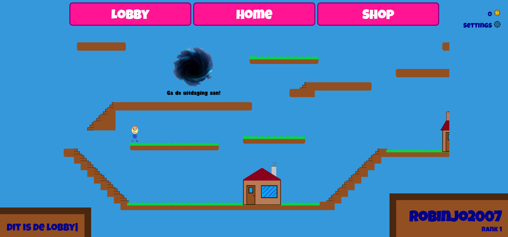

# Platformed

This is a simple platformer I designed to learn JS and Phaser. The objective is to solve puzzles and complete levels, while collecting as much coins as possible to upgrade your house.

It isn't finished yet, and I will probably never finish it.

